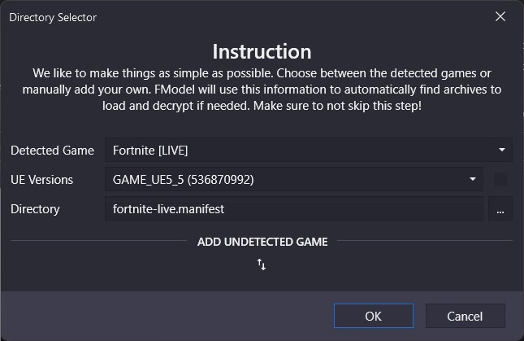

# Using Fmodel
*This section was written by @muuyo*

 

Fmodel is a fairly intuitive piece of software that lets you browse through the game files in a lot less opaque way than Umodel, and as of recently, [supports exporting models and animations!](../tools/blender.md#fmodel-with-arc-system-works-animation-support)
To set it up, you require a bit of legwork.
- Download it from WistfulHopes' [fork of Fmodel to allow Arcsys animation support](https://github.com/WistfulHopes/FModel/releases/tag/arcsys), you're looking for Fmodel-ArcSys.rar.
- Put the EXE wherever you'd like (feel free to ignore the other files, they're for compiling)
- Open it, and you'll be presented with a page that looks like this.

Now, you need to add Guilty Gear as a custom game.
- Click the small two arrows, and put in Guilty Gear Strive then browse to the game's file location on your computer. After, hit the small plus.
- Select this newly added game in the Detected Game section.
- Make sure the box beside 'UE versions' is *unchecked*, then select "GAME_UE4_25" (for Unreal version 4.25, which the game uses)
After, you should be prepped to use Fmodel! Hit OK, then double click the `pakchunk0-WindowsNoEditor.pak` to start browsing the game's files.

This document will not be going over how to use Fmodel, however it's fairly self explanatory and [it has its own documentation, linked here.](https://github.com/4sval/FModel/wiki)